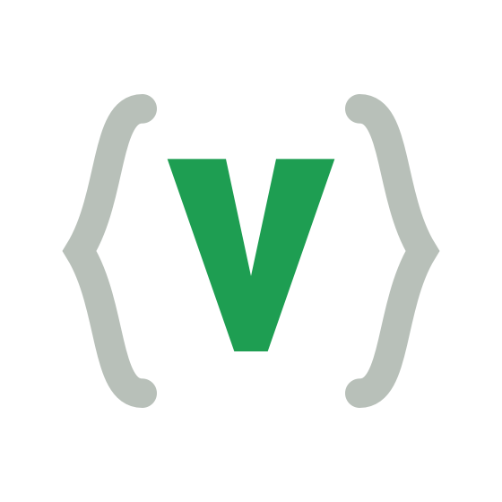
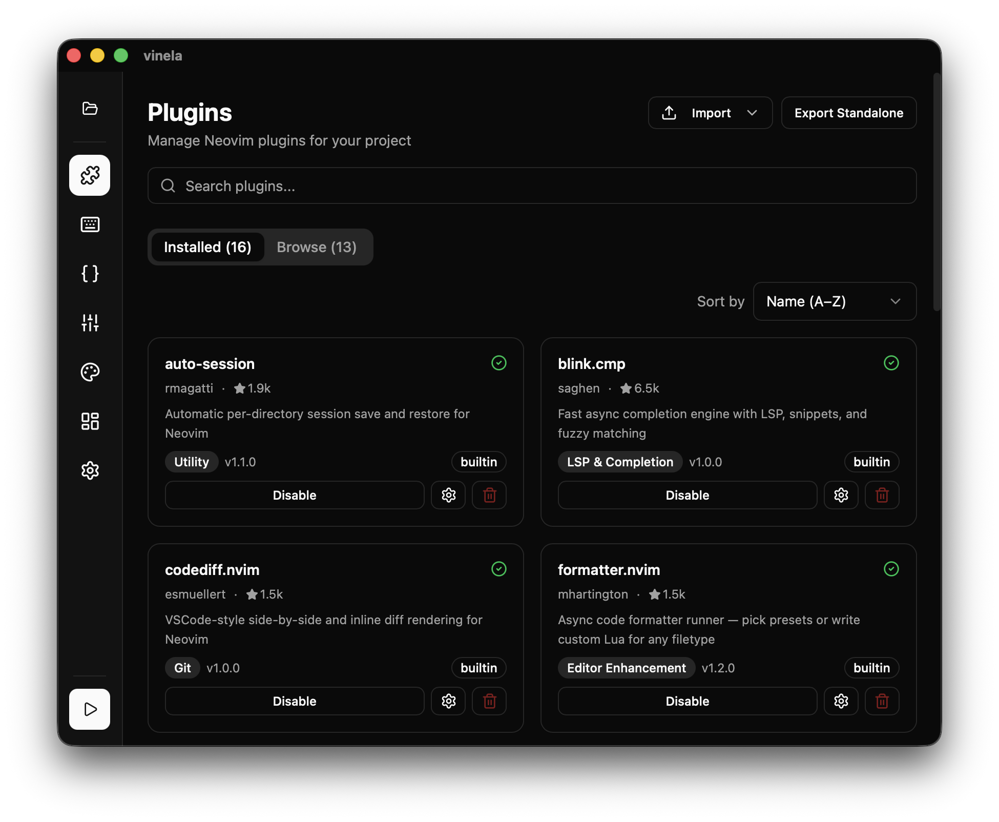
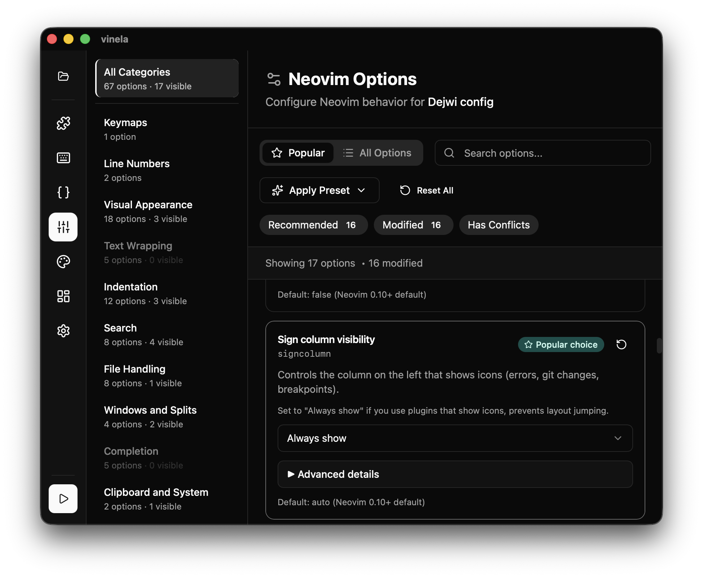
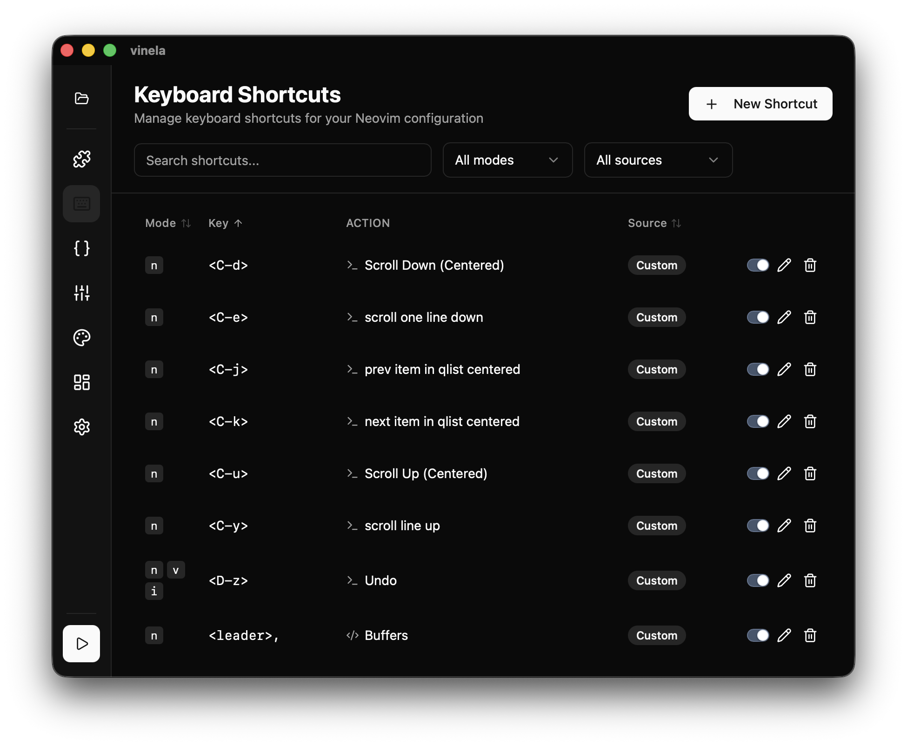
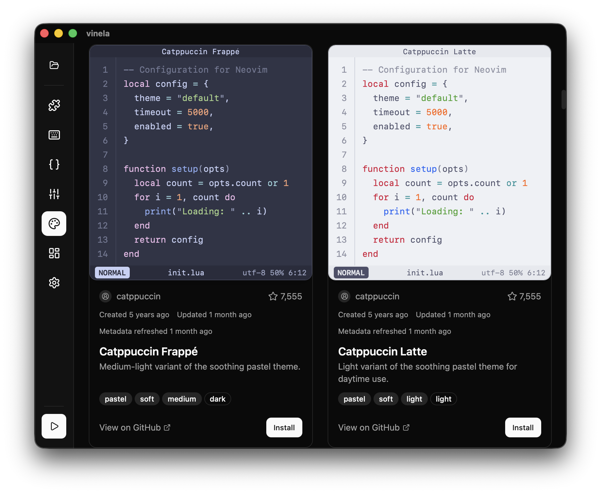
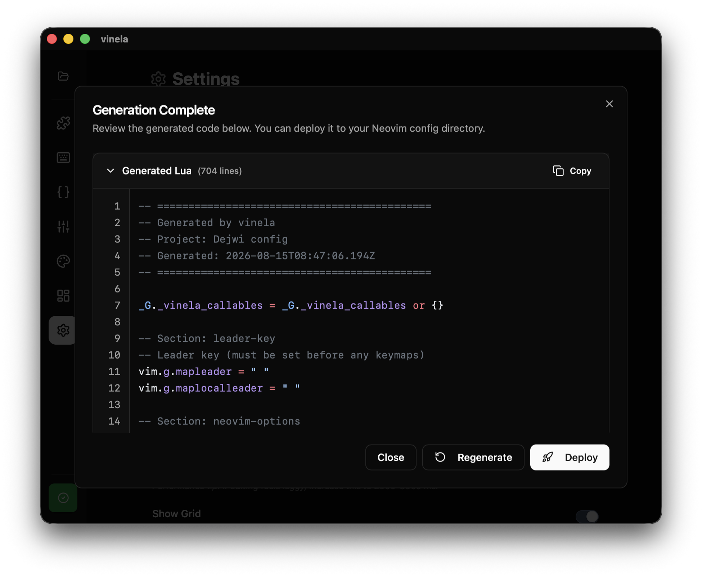
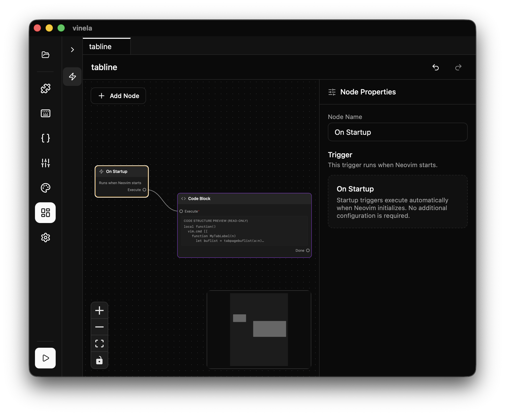

<div align="center">

<picture>
  <source media="(prefers-color-scheme: dark)" srcset="assets/branding/vinela-logo-transparent-dark.svg">
  
</picture>

# vinela

**A visual editor for your Neovim config.**

Configure plugins, options, keymaps and startup logic in a GUI. vinela generates a single readable `init.lua` and deploys it to your Neovim config directory.

[](https://vinela.dev)

**No install, no Neovim needed** - the full editor in your browser, with an example project already loaded.

[](LICENSE)




</div>

---

## Why

Neovim configs rot. They start as a copied dotfile, grow into 20 Lua modules nobody remembers writing, and break on the next plugin-manager migration. The problem isn't Lua, it's that nothing tells you what your config currently does.

- **Everything in one place.** Installed plugins and their options, every keymap with its conflicts, every Neovim option you've touched.
- **The output is yours.** Plain `vim.pack`-based Lua with no runtime dependency on vinela. Delete the app and the config still works.
- **Nothing happens behind your back.** You read the generated Lua before it's written, and the old config is backed up first.
- **Plugins are data.** Plugin support comes from JSON schemas, not hardcoded branches, so anyone can add one.

This is config management, not a config framework. Nothing from vinela runs inside your editor.

## How it works

```
project (folder)  ->  Lua generator  ->  init.lua  ->  ~/.config/nvim
  ├── project.json
  ├── graphs/          # node graphs (startup logic, callables, autocmds, keymaps)
  └── schemas/         # project-local plugin schemas
```

A project is a self-contained folder you can commit to git. Generation happens in memory; deploying is a separate step you trigger, and it backs up whatever config is already there.

## Features

**Plugins.** Install, configure, pin versions, override versions per project. The config UI for each plugin is generated from its schema.

| | |
|---|---|
| **Neovim options.** 67 options with categories, presets, conflict detection and docs per option. | **Keymaps.** Every mapping in one table, with its source and conflict detection across plugins and graphs. |
|  |  |
| **Color schemes.** 39 variants across 16 theme families, previewed with real syntax highlighting before you install anything. | **Generation and deploy.** Diagnostics run before generation, and you read the Lua before it lands. |
|  |  |

### Graph editor (experimental)

> Heads up: this part is barely used in practice. Everything above runs my daily config; the graph editor got built out but my own setup never really needed it, so it has far less real-world mileage. It works and it's covered by tests, but expect sharp edges. Bug reports welcome.



For anything that isn't a flat setting. Node graphs cover startup logic, autocmds, keymap actions and reusable callables. Core action nodes: set option, run action, set keymap, set variable, get variable, create autocmd, set highlight. On top of that, plugin function nodes come from schemas, and raw Lua code blocks are there when you want them. Graphs can call other graphs, can be disabled individually (with transitive dependency tracking), and are diffable JSON.

## Built-in plugins

28 plugin schemas ship with the app. Plugins are installed through Neovim's native `vim.pack`, so there's no third-party plugin manager involved.

**LSP & completion**
| Plugin | |
|---|---|
| [nvim-lspconfig](https://github.com/neovim/nvim-lspconfig) | Default configurations for 100+ language servers |
| [blink.cmp](https://github.com/saghen/blink.cmp) | Fast async completion with LSP, snippets and fuzzy matching |
| [mason.nvim](https://github.com/mason-org/mason.nvim) | Portable package manager for servers, formatters and linters |

**Navigation**
| Plugin | |
|---|---|
| [telescope.nvim](https://github.com/nvim-telescope/telescope.nvim) | Highly extensible fuzzy finder over lists |
| [vim-tmux-navigator](https://github.com/christoomey/vim-tmux-navigator) | Move between Vim splits and tmux panes with the same keys |

**Editing**
| Plugin | |
|---|---|
| [nvim-surround](https://github.com/kylechui/nvim-surround) | Add/change/delete surrounding pairs, tags and function calls |
| [mini.pairs](https://github.com/nvim-mini/mini.pairs) | Minimal autopairs |
| [substitute.nvim](https://github.com/gbprod/substitute.nvim) | Substitute text objects from registers, swap regions |
| [formatter.nvim](https://github.com/mhartington/formatter.nvim) | Async formatter runner with presets or custom Lua |
| [vim-maximizer](https://github.com/szw/vim-maximizer) | Toggle-maximize the current split |

**Syntax**
| Plugin | |
|---|---|
| [nvim-treesitter](https://github.com/nvim-treesitter/nvim-treesitter) | Parser management and core highlighting (0.12+ `main`) |
| [markview.nvim](https://github.com/OXY2DEV/markview.nvim) | In-buffer previews for Markdown, LaTeX, Typst, YAML and more |

**Git**
| Plugin | |
|---|---|
| [codediff.nvim](https://github.com/esmuellert/codediff.nvim) | VSCode-style side-by-side and inline diffs |

**Utility**
| Plugin | |
|---|---|
| [snacks.nvim](https://github.com/folke/snacks.nvim) | QoL suite: picker, explorer, dashboard, notifier and more |
| [auto-session](https://github.com/rmagatti/auto-session) | Per-directory session save and restore |
| [prettier.nvim](https://github.com/MunifTanjim/prettier.nvim) | Prettier integration |
| [dotenv.nvim](https://github.com/ellisonleao/dotenv.nvim) | Load `.env` files into `vim.env` |
| [nvim-web-devicons](https://github.com/nvim-tree/nvim-web-devicons) | Nerd Font filetype icons (dependency of most UI plugins) |

**Themes:** [catppuccin](https://github.com/catppuccin/nvim), [tokyonight](https://github.com/folke/tokyonight.nvim), [kanagawa](https://github.com/rebelot/kanagawa.nvim), [rose-pine](https://github.com/rose-pine/neovim), [nightfox](https://github.com/EdenEast/nightfox.nvim), [sonokai](https://github.com/sainnhe/sonokai), [nordic](https://github.com/AlexvZyl/nordic.nvim), [oxocarbon](https://github.com/nyoom-engineering/oxocarbon.nvim), [vague](https://github.com/vague-theme/vague.nvim), [vscode.nvim](https://github.com/Mofiqul/vscode.nvim)

Beyond that list, you can import any plugin schema from a GitHub repo or a local JSON file, either per project or globally.

## Adding your own plugin

Plugin support is entirely schema-driven. There is no plugin-specific code in vinela's core. A schema is one JSON file describing a plugin's setup options, functions, Ex-commands, events and keymaps, and vinela derives both the config UI and the generated Lua from it.

Plugin authors: drop a `vinela.schema.json` at your repository root and users can import it straight from the URL.

The authoring workflow ships as an agent skill with an offline validator:

```bash
npx skills add dejwi/vinela --skill vinela-plugin-schema
node scripts/validate-plugin-schema.mjs path/to/vinela.schema.json
```

- Machine contract: [`schema/plugin-schema.schema.json`](schema/plugin-schema.schema.json). Point your editor's `$schema` at it for completion.
- Authoring guide: [`skills/vinela-plugin-schema/SKILL.md`](skills/vinela-plugin-schema/SKILL.md)

If the contract can't express something your plugin needs, open an issue. The fix is always a new generic capability, never a special case for one plugin.

## Install

The generated config targets **Neovim 0.12+**.

Prebuilt binaries are published on the [Releases](https://github.com/dejwi/vinela/releases) page. To build it yourself:

```bash
bun install
bun run build        # bundles for your platform
```

Prerequisites: [Bun](https://bun.sh/) 1.0+, [Rust](https://rustup.rs/) stable, and the [Tauri prerequisites](https://tauri.app/start/prerequisites/) for your OS.

### macOS: the build is not signed

The macOS builds are not code-signed or notarized (that needs a paid Apple Developer account), so Gatekeeper blocks them on first launch with "vinela is damaged and can't be opened" or "cannot be opened because the developer cannot be verified".

One command fixes it, after dragging the app to `/Applications`:

```bash
xattr -dr com.apple.quarantine /Applications/vinela.app
```

Or through the UI: try to open the app, dismiss the warning, then go to **System Settings > Privacy & Security**, scroll to the Security section, and click **Open Anyway** next to the message about vinela. Confirm with **Open Anyway** in the dialog and authenticate. Control-click > Open no longer works for unsigned apps on macOS 15 and newer.

## Development

```bash
bun run dev          # run the app
bun run test         # vitest (not `bun test`)
bun run lint         # biome, fail-closed on warnings
bun run typecheck
```

Architecture, conventions and per-subsystem docs live in [`AGENTS.md`](AGENTS.md) and [`docs/`](docs/). For the generator, start with [`docs/lua-generator/README.md`](docs/lua-generator/README.md).

**Stack:** Tauri 2, React + TypeScript (strict), Zustand + zundo, React Flow, TailwindCSS, shadcn/ui, Biome, Vitest, Bun.

## License

Copyright (C) 2026 Vinela contributors.

Free software under the [GNU Affero General Public License v3.0 only](LICENSE) (`AGPL-3.0-only`). Commercial use is permitted subject to that license, including its source-sharing and notice-preservation requirements. Original source: <https://github.com/dejwi/vinela>

Third-party components retain their own licenses; the plugin-schema validator's notices are in [`skills/vinela-plugin-schema/THIRD_PARTY_NOTICES.md`](skills/vinela-plugin-schema/THIRD_PARTY_NOTICES.md).
